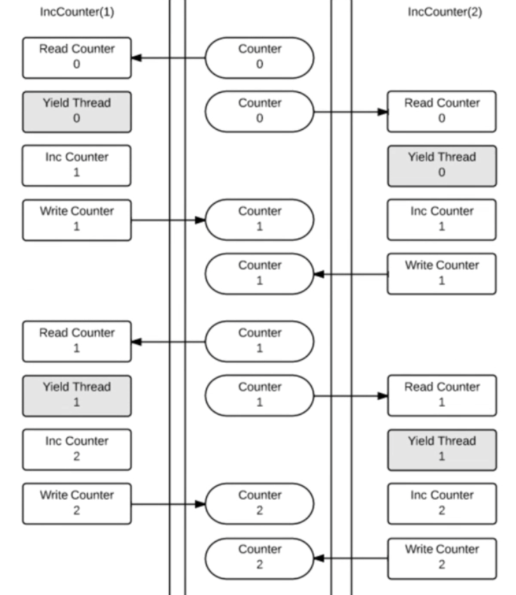

# Race Condition
When you have multiple streams of work going on at a time that access the same variable, the read/write
process can become jumbled as the different streams write to the same memory location; often overwriting
the data.



As you can see from this example, instead of incrementing the number by one and moving the number from 1 to 2
it overwrites the updated counter to what it thinks is the new value based on what it fetched earlier in the
process (i.e. 0).

## Effective Go Excerpt

[Effective Go - Methods of Communication](https://golang.org/doc/effective_go.html#sharing)

Concurrent programming is a large topic and there is space only for some Go-specific highlights here.

Concurrent programming in many environments is made difficult by the subtleties required to implement correct 
access to shared variables. Go encourages a different approach in which shared values are passed around on 
channels and, in fact, never actively shared by separate threads of execution. Only one goroutine has access 
to the value at any given time. Data races cannot occur, by design. To encourage this way of thinking we have 
reduced it to a slogan:

Do not communicate by sharing memory; instead, share memory by communicating.
This approach can be taken too far. Reference counts may be best done by putting a mutex around an integer 
variable, for instance. But as a high-level approach, using channels to control access makes it easier to 
write clear, correct programs.

One way to think about this model is to consider a typical single-threaded program running on one CPU. It has 
no need for synchronization primitives. Now run another such instance; it too needs no synchronization. Now 
let those two communicate; if the communication is the synchronizer, there's still no need for other 
synchronization. Unix pipelines, for example, fit this model perfectly. Although Go's approach to concurrency 
originates in Hoare's Communicating Sequential Processes (CSP), it can also be seen as a type-safe generalization
 of Unix pipes.

## Running main.go
When you run the `main.go` file inside this directory, you would expect the count to be 100 because we're looping
100 times to increase a counter. But that number is different every time you run the file.

```
1st Run
CPUs: 16
Goroutines start: 1
Goroutines end: 1
Count: 36

2nd Run
CPUs: 16
Goroutines (start): 1
Goroutines (end): 1
Count: 82
```

You can use the option `-race` when you run `go run main.go` to ask go to see if it can detect a race condition.
This could be a really handy way to double check your code. Potentially super useful to add into a CI/CD pipeline.