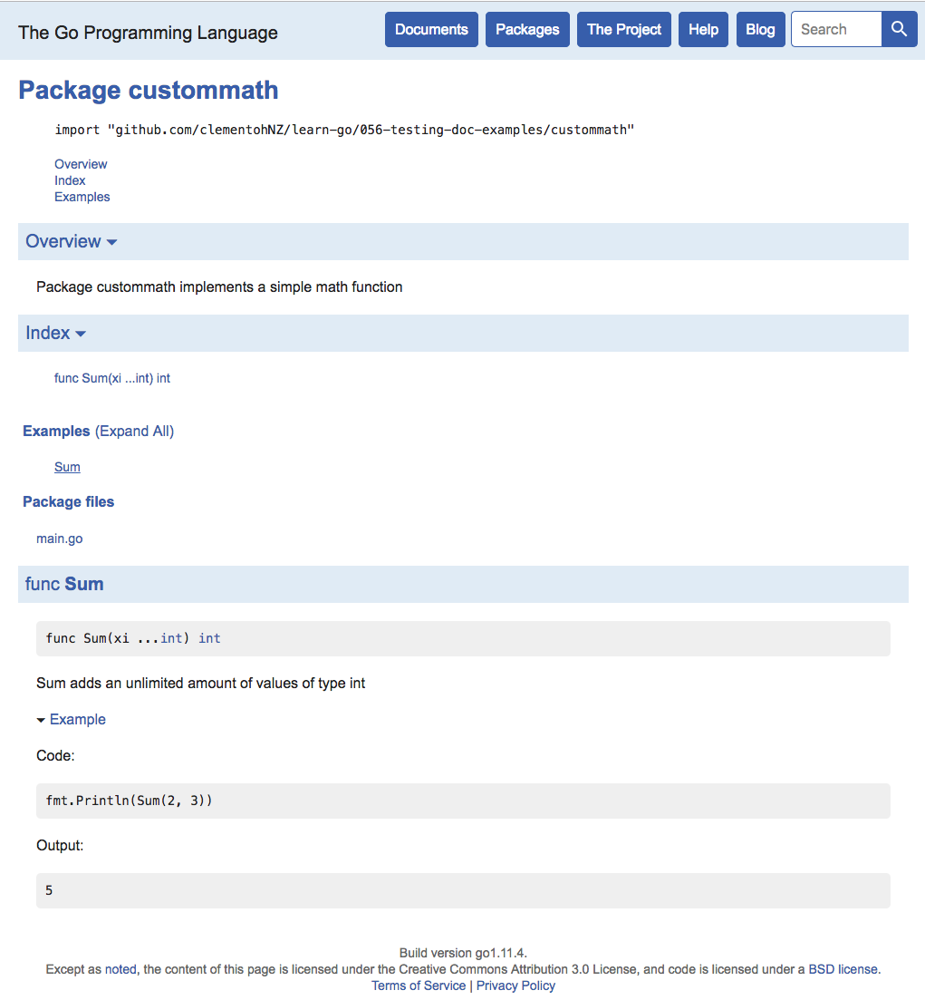

# Testing with Examples
To test your code and provide working examples at the same time, go has created
some neat syntax for you.

If you start your function with `Example` followed by the function name, you can
use comments to create your expectations, which will be translated to documentation.

```go
package custommath

import "fmt"

func ExampleSum() {
	fmt.Println(Sum(2, 3))
	// Output:
	// 5
}
```



More info and examples [here](https://blog.golang.org/examples)