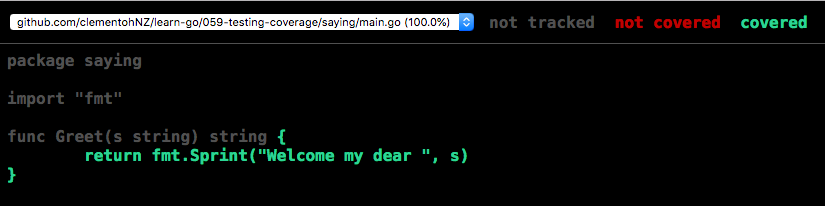

# Test Coverage
To have test coverage, you can simply run `go test ./... -cover`

**Example Output:**
```
?   	github.com/clementohNZ/learn-go/059-testing-coverage	[no test files]
ok  	github.com/clementohNZ/learn-go/059-testing-coverage/saying	0.003s	coverage: 100.0% of statements
```

To find out more info, run `go help testflag`

## Outputting to file
```
$ go test ./... -coverprofile c.out
?   	github.com/clementohNZ/learn-go/059-testing-coverage	[no test files]
ok  	github.com/clementohNZ/learn-go/059-testing-coverage/saying	0.003s	coverage: 100.0% of statements
```

This will generate a file where you ran the command.

## Viewing test coverage in html
To view your coverage visually from the file you just generated, you can run this command:

`go tool cover -html=c.out`



To find out more about go tools, you can run:

`go tool` to view all the available tools; and

`go tool cover -help` to find information on that specific tool